# Vision-Guided Helmet Inspection

<p>
  
  
  
  
</p>

**An OMRON TM collaborative robot operates the visors of a motorcycle helmet, then scans the shell with an eye-in-hand ZED Mini stereo camera, locates surface defects in 3D and marks each one, all with a single custom end-effector.**

<p align="center">
  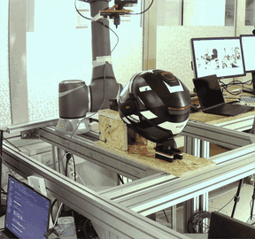
</p>

## Highlights

- **Won the course competition** as the fastest team with the fewest errors.
- **Built from scratch**: starting only from the course's low-level robot communication library, we wrapped it in a custom `RobotController` that fixes its weaknesses (blocking moves that wait for the target pose within 0.5 mm / 0.5°, timeouts, safe home pose) and built the whole stack on top of it.
- **Layered, modular code**: four base modules, three higher-level modules and two workflow notebooks. Robot I/O and camera I/O each live in a single module, and the kinematics are pure NumPy.
- **Custom fixture and end-effector**: a tool-free, modular fixture holds the helmet in the same position every cycle, and one 3D-printed end-effector (visor finger, ZED Mini, LED ring, spring-loaded marker) runs the whole cycle with no tool changes.
- **Automatic inspection**: a 7-pose scan, 3D localisation, duplicate removal, 10-shot refinement and marking. A motion planner keeps the camera aimed at the helmet centre and routes around unsafe zones.
- **Hardware**: an OMRON TM cobot (the visor sequence ran on both a TM12 and a TM5), a Stereolabs ZED Mini and Python.

**Contents**: [Overview](#overview) · [Code architecture](#code-architecture) · [The cell](#the-cell) · [Fixture](#fixture-design) · [Phase 1](#phase-1-visor-handling) · [Phase 2](#phase-2-inspection-and-marking) · [Results](#results) · [Repository layout](#repository-layout) · [Getting started](#getting-started) · [Module reference](#module-reference) · [Team](#team-and-credits)

## Overview

The project was built for the course *Innovative Applications of Industrial Robotics* at Politecnico di Milano. The cell runs two phases on the same helmet:

- **Phase 1, visor handling**: open the clear visor, operate the inner sun visor with its slider and its button, close the clear visor and return home.
- **Phase 2, inspection and marking**: find the defects on the shell, locate each one in the robot frame and mark it with a pen.

The work is organised around six pillars. Each maps to hardware or code in this repository:

| Pillar | Goal | Where |
|---|---|---|
| Constraining | Hold the helmet rigidly and repeatably | [cad/Front_support](cad/Front_support/), [cad/Back_support](cad/Back_support/) |
| End effector | One tool for handling, vision, lighting and marking | [cad/End-Effector](cad/End-Effector/) |
| Handling | Robot control and visor tasks | [robot_control.py](robot_control.py), [PHASE1_opening.ipynb](PHASE1_opening.ipynb) |
| Acquisition | Scan the shell with the stereo camera | [spherical_movement.py](spherical_movement.py), [camera_scripts_v2.py](camera_scripts_v2.py) |
| Detection | Turn 2D masks into 3D defect positions | [camera_scripts_v2.py](camera_scripts_v2.py), [defects_id_wrapper.py](defects_id_wrapper.py) |
| Inspection and marking | Find, refine and mark every defect | [inspection_and_marking.py](inspection_and_marking.py), [PHASE2_inspection_marking_together.ipynb](PHASE2_inspection_marking_together.ipynb) |

## Code architecture

The software has three layers:

- **Base modules** are the building blocks.
- **Higher-level modules** combine the base modules into the real operations.
- **Notebooks** run the two workflows.

In the diagram, each edge is labelled with the main names one module uses from the other.

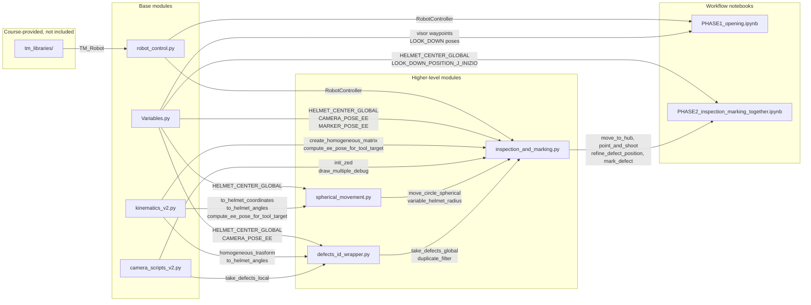

Design choices:

- **Hardware behind two modules.** `robot_control.py` is the only module that talks to the robot, and `camera_scripts_v2.py` is the only one that talks to the ZED. `kinematics_v2.py` depends only on NumPy, so it can be tested without hardware.
- **Blocking motion.** `RobotController` sends commands through the TM Listen Node and polls the pose over Modbus TCP until the maximum error is at most 0.5 mm / 0.5°, with a 300 s timeout. This makes every sequence deterministic.
- **Tool-agnostic positioning.** The camera and the marker are just tool offsets (`CAMERA_POSE_EE` and `MARKER_POSE_EE`), so a new tool needs only a new offset.
- **Safety inside the motion layer.** Every spherical move is checked against the safety envelope (see [Scan trajectory](#scan-trajectory)) before the robot moves.
- **One place for each kind of setting.** Calibration values (tool offsets, the helmet centre and the taught poses) are in `Variables.py`. The inspection, refinement and marking parameters are module-level constants in `inspection_and_marking.py`.

## The cell

<p align="center">
  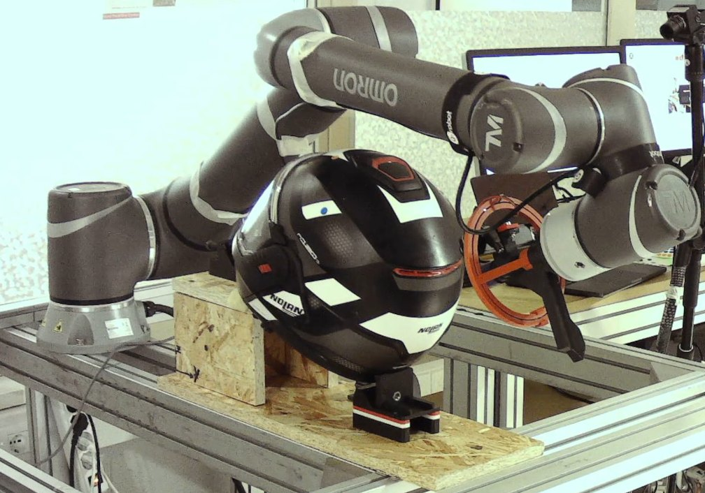
</p>

The helmet sits in a fixed fixture in front of an OMRON TM cobot. Everything the robot needs is on one end-effector, so a full cycle runs without tool changes:

| # | Component | Role |
|---|---|---|
| 1 | Base with integrated finger | Structural backbone and robot mount. The finger performs the manual tasks on the visors. It is one printed piece, with no joint or fastener to fail. |
| 2 | Stereo-camera support | Holds the ZED Mini. Grooves matched to the camera housing make it self-aligning. |
| 3 | ZED Mini stereo camera | Captures RGB images and an XYZ point cloud of the shell. |
| 4 | LED ring and support | Gives uniform illumination. The support has a snap-fit mount. |
| 5 | Marker system | A cap, a marker and a spring. The spring gives axial compliance that damps the contact force, and the pen is retractable. |

<p align="center">
  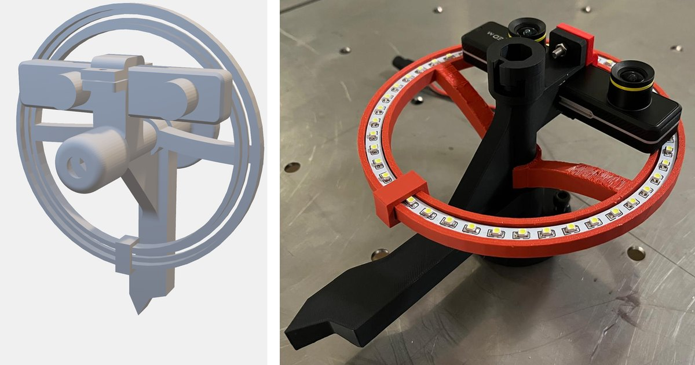
</p>

## Fixture design

The fixture was designed around five requirements:

- **Stability**: rigid under external loads.
- **Repeatability**: the same position every cycle.
- **Accessibility**: a clear approach for the visors and the marker.
- **Modularity**: adjustable to different helmet sizes.
- **Fast mounting**: mounts and dismounts quickly, without tools.

<p align="center">
  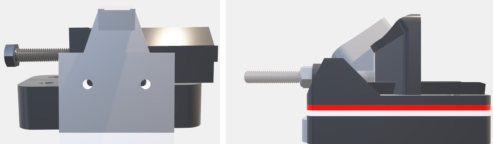
</p>

The fixture has two parts: a front push-clamp and a rear support base. Reference markers on the base let the camera measure where the fixture sits in the robot frame (see [Helmet positioning.ipynb](Helmet%20positioning.ipynb)). The SolidWorks parts and assemblies are in [cad/](cad/).

<p align="center">
  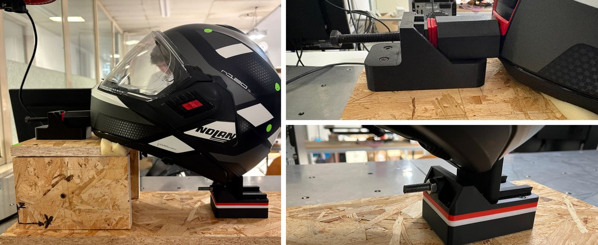
</p>

## Phase 1: visor handling

Phase 1 is position-based. [PHASE1_opening.ipynb](PHASE1_opening.ipynb) replays a sequence of taught waypoints from [Variables.py](Variables.py) through `RobotController`, a synchronous wrapper around the Techman Listen Node. Every command blocks until the robot is within 0.5 mm / 0.5° of the target, so each step starts only after the previous one has finished. Four motion primitives cover the whole task:

- **Joint moves** for the home pose and for repositioning between tasks.
- **Cartesian point-to-point** moves for fast transfers.
- **Linear moves** of the tool to engage the visor tab, the sun-visor slider and the button.
- **3D arcs** that open and close the clear visor.

The sequence opens the clear visor, then operates the sun visor with its slider and then its button. It then closes the clear visor and returns to the home joint configuration, which is also where Phase 2 starts and ends. In the committed notebook run, the whole sequence takes 9.00 s from home back to home.

### Pose generalisation

Hand-taught poses only hold for one cell and one robot, so we express every taught pose relative to a reference marker on the fixture and map it onto the marker's measured pose, `P_new = H_new · H_base^-1 · P_taught`. Only the marker has to be measured again, and this let us run the visor sequence on both an OMRON TM12 and a TM5. In the delivered code the fixture only translated, so the mapping reduces to a 90 mm shift along y, measured with [Helmet positioning.ipynb](Helmet%20positioning.ipynb) and stored as `Y_OFFSET` in [Variables.py](Variables.py).

<table>
  <tr>
    <td width="50%">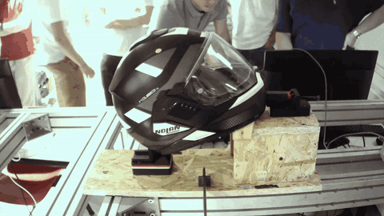</td>
    <td width="50%">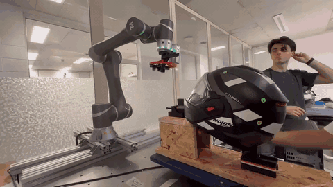</td>
  </tr>
  <tr>
    <td align="center">Opening the clear visor</td>
    <td align="center">The same sequence on a second robot</td>
  </tr>
</table>

## Phase 2: inspection and marking

Phase 2 is fully automatic. It scans the helmet from fixed poses, detects and locates the defects, merges duplicates, refines each defect with close-up shots and marks it.

### Reference frames and tool positioning

<p align="center">
  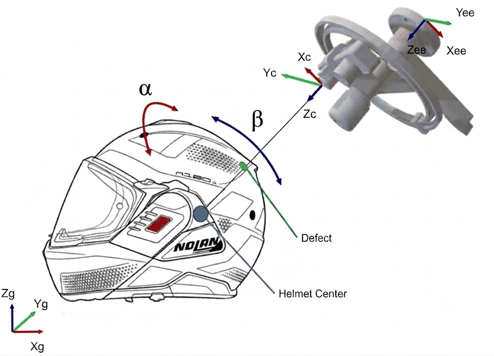
</p>

Four frames are involved: the robot base (global frame), the end-effector, the tool (the camera or the marker, each with its own fixed offset) and the helmet. A single 4×4 homogeneous matrix `H` carries rotation and translation between them.

- **Camera to global**: `H_cam→global = H_ee→global · H_cam→ee` brings a defect seen by the camera into the robot frame. It is rebuilt from the live TCP pose for every shot.
- **Tool to end-effector**: `H_ee = H_target · H_tool→ee^-1` removes the tool offset from a target. The same function (`compute_ee_pose_for_tool_target`) can therefore position either the camera or the marker, depending on which offset it is given.
- **Orientation** uses Z-Y-X Cardan angles, the same convention the Techman controller uses. Angles are recovered with `atan2`.
- **Helmet coordinates** are spherical, `[r, α, β]`. β runs from the rear of the helmet (0°) over the apex (90°) to the front (180°). α rotates that direction sideways around the helmet's front-to-back axis, with 0° in the vertical plane through the apex. In our plots we call α the azimuth and β the elevation. The poles of this system are at the rear and front, where the robot never goes.

### Scan trajectory

The camera moves on a surface around the helmet and its optical axis always points at the helmet centre. For a camera position `p` relative to the centre, `Z_cam = -p / ||p||`. This keeps the camera close to perpendicular to the shell.

A sphere of constant radius either collides with the top of the shell or leaves the camera too far from the lower collar. `variable_helmet_radius(α, β)` replaces it with a flared, paraboloid-like surface. The radius is **380 mm** at the apex, **300 mm** at the sides and back, and **450 mm** at the front to clear the chin guard, with continuous `sin²`/`cos²` blends in between. The code also places a virtual helmet centre below the real one, so that low defects stay within the allowed range of α.

<table>
  <tr>
    <td width="50%">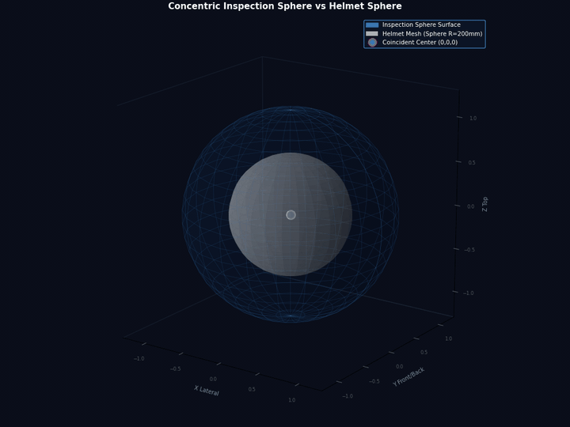</td>
    <td width="50%">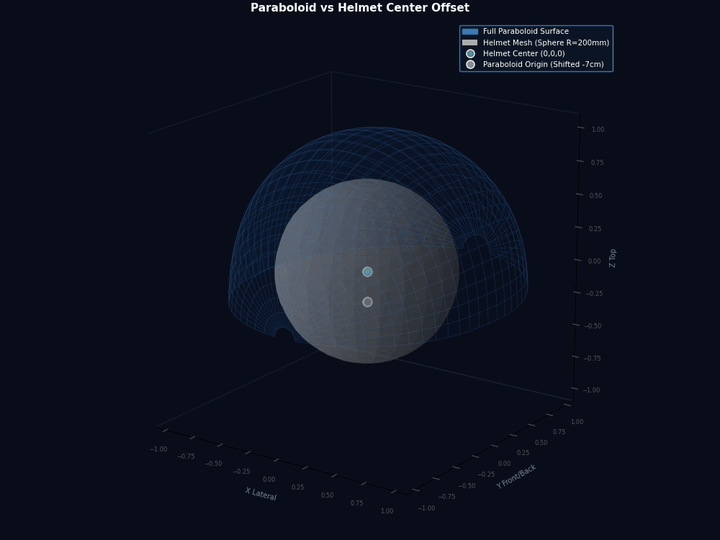</td>
  </tr>
  <tr>
    <td align="center">Constant-radius sphere, concentric with the helmet</td>
    <td align="center">Variable-radius surface, origin 70 mm below the helmet centre</td>
  </tr>
</table>

Every move around the helmet goes through `move_circle_spherical`, which enforces a safety envelope:

| Unsafe zone | Rule | Purpose |
|---|---|---|
| Lateral limit | abs(α) > 89° | Keeps the wrist away from kinematic singularities |
| Rear / low boundary | β < 20° + 25°·(α / 90°)² | Avoids collisions with the supporting table |
| Front limit | β > 110° | Keeps the tool away from the visor area |

- If the destination is unsafe, the move is refused.
- The direct path is checked at 100 samples. If it crosses an unsafe zone, the planner detours through the apex (α = 0°, β = 90°).
- Moves that span more than 90° in α or β are split in two.
- Moves shorter than 5° run as a single point-to-point move.
- Longer moves run as a 3D arc through the angular midpoint. The radius is taken from the surface at the midpoint and at the end point.

The trajectories were validated in a digital twin, with the helmet modelled as a 200 mm sphere and the paraboloid centre 70 mm below it. In the animation, the end-effector follows a planned trajectory on the safe surface around the red prohibited zones, and the camera Z-axis stays on the helmet centre:

<p align="center">
  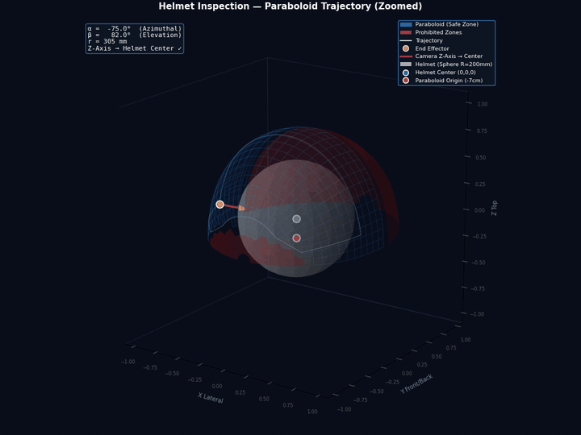
</p>

### Defect detection

Each capture produces an RGB image and an XYZ point cloud (ZED HD720, neural depth mode, in millimetres). Detection runs in eight steps:

1. **Colour mask**, in one of two modes. **Green** mode thresholds a known defect colour in HSV. **Generic** mode builds a mask of the expected helmet colours (black, white, grey and red) and inverts it, so any unexpected colour becomes a candidate.
2. **Mask cleaning**: an optional attention radius (in pixels) limits the search to the centre of the image. A 5×5 opening removes isolated noise and a closing fills small holes.
3. **Blob filtering**: only external contours are kept, and blobs under 800 px are rejected.
4. **Centroid and isolated mask**: each defect gets its own binary mask, its area and a centroid computed from the image moments.
5. **2D to 3D**: every white pixel of the mask is looked up in the point cloud. Failed lookups, non-finite values and non-positive depths are rejected. The defect's position in the camera frame is the mean of the remaining points.
6. **Cylinder filter**: defects outside a cylinder around the optical axis are discarded. The cylinder has a lateral radius and a depth window: 150 mm and 50 to 200 mm during the global scan.
7. **Global and helmet coordinates**: `P_global = H_cam→global · P_cam`, then `[r, α, β] = to_helmet_angles(P_global, helmet_center)`.
8. **Defect record**: each `defect` object carries its 2D evidence (centroid, area, mask and image) and its 3D localisation (points, and the camera, global and spherical positions) through the rest of the pipeline.

<p align="center">
  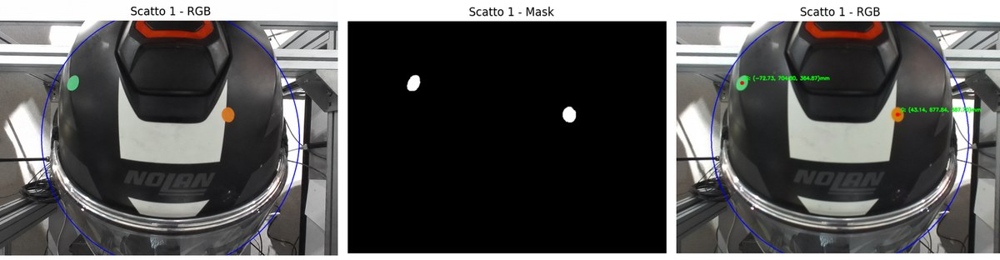
</p>

### Inspection, refinement and marking

**Global inspection.** The camera visits 7 hand-picked directions on the variable-radius surface that together cover the inspectable shell. The list is defined in the Phase 2 notebook. At each pose it waits 1 s for residual vibrations to settle, reads the actual TCP pose and then captures.

| Shot | 1 | 2 | 3 | 4 | 5 | 6 | 7 |
|---|---|---|---|---|---|---|---|
| α | 0° | 0° | 0° | 45° | 40° | -40° | -45° |
| β | 90° (top) | 45° | 25° | 45° | 80° | 80° | 45° |

<table>
  <tr>
    <td width="50%">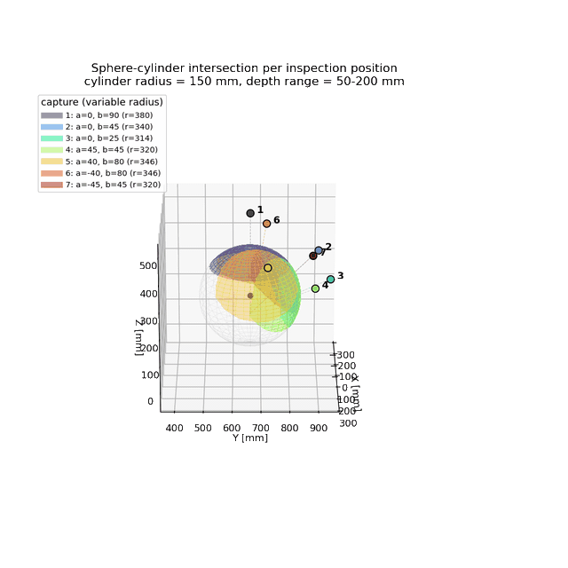</td>
    <td width="50%">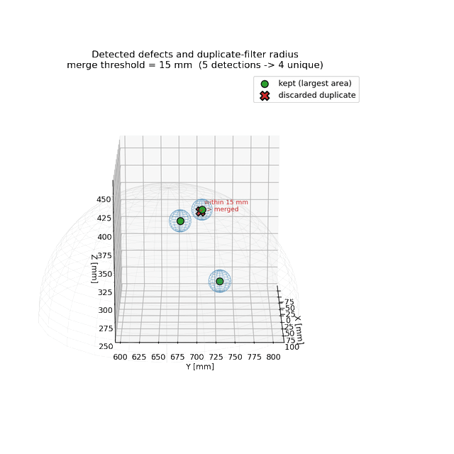</td>
  </tr>
  <tr>
    <td align="center">Area covered by each of the 7 captures</td>
    <td align="center">Duplicate filter: 5 detections merged into 4 unique defects</td>
  </tr>
</table>

**Duplicate filtering.** The fields of view overlap, so the same defect is often seen more than once. Defects closer than **15 mm** in the global frame are merged. The one with the largest pixel area, which is the best-seen view, is kept.

**Refinement and marking** run back to back for each unique defect, which saves travel time:

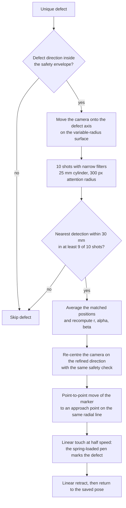

- The approach point lies on the defect's radial line, at `max(r_defect + 50 mm, 250 mm)` from the helmet centre.
- The touch is a linear move at 150 mm/s and the retract a linear move at 300 mm/s.
- We measured that averaging over the ten shots corrects the position by about 2 mm on average, and that the same point is marked across repeated inspection runs.

<p align="center">
  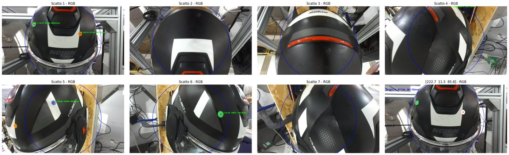
</p>

<p align="center">
  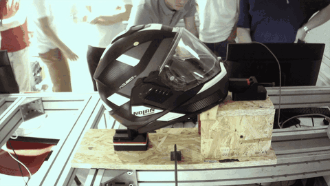
</p>

## Results

- **Course competition**: the team won as the fastest team with the fewest errors.
- **Phase 1**: in the committed notebook run, the full visor sequence takes **9.00 s**.
- **Phase 2**: in the committed notebook run, the robot inspects the helmet from 7 poses.
  - It finds 5 detections, which the duplicate filter reduces to 4 unique defects.
  - Three defects are confirmed in 10 of 10 refinement shots, with position corrections of 2.3, 3.5 and 2.1 mm, and are marked.
  - The fourth (α 56.5°, β 20.8°) lies inside the rear unsafe zone, so the planner skips it.
  - The run takes **35.99 s** from the start of the scan until the robot is back home, about 12 s per marked defect.

Our final outcomes:

- Fast, tool-free fixturing.
- An integrated end-effector.
- A vision pipeline that locates coloured defects in 3D.
- A detect, refine and mark cycle that runs automatically.

## Repository layout

```text
.
├── PHASE1_opening.ipynb                      # Phase 1 workflow: visor opening and closing
├── PHASE2_inspection_marking_together.ipynb  # Phase 2 workflow: inspection, refinement, marking
├── Helmet positioning.ipynb                  # Fixture alignment check and helmet-centre measurement
├── test_spherical.ipynb                      # Manual smoke test of spherical motion
├── Variables.py                              # Tool offsets, helmet centre, taught waypoints
├── robot_control.py                          # RobotController: blocking TM motion primitives
├── kinematics_v2.py                          # Homogeneous transforms, Euler angles, helmet coordinates
├── camera_scripts_v2.py                      # ZED capture, colour masks, 2D-to-3D localisation
├── defects_id_wrapper.py                     # Camera-to-global transform, filters, duplicate removal
├── spherical_movement.py                     # Variable-radius surface, safety envelope, arc planner
├── inspection_and_marking.py                 # Scan, refinement and marking routines
├── requirements.txt
├── ethernet_tables/
│   └── Default.json                          # Default TM Ethernet Slave table, read by tm_libraries
├── cad/                                      # SolidWorks sources
│   ├── Back_support/
│   ├── Front_support/
│   └── End-Effector/                         # Includes ASSEMBLY.STL
├── documents/                                # Project slides (PDF)
└── media/                                    # GIFs and figures used in this README
```

## Getting started

### Requirements

- An OMRON TM robot. The code uses three connections to the controller:
  - the Listen Node (TCP 5890), for motion scripts;
  - Modbus TCP (port 502), for pose feedback;
  - the Ethernet Slave (port 5891), which the course library opens.
- The Techman communication library `tm_libraries/`. It was provided by the course and is not included in this repository. Place a copy in the repository root, because `robot_control.py` imports `tm_libraries.techman`.
- For Phase 2, a ZED Mini with the Stereolabs ZED SDK and its Python API (`pyzed`). Install `pyzed` with the SDK's `get_python_api.py` script, not from PyPI.
- Python 3.9 or newer (the notebooks were last run with 3.14), the packages in [requirements.txt](requirements.txt), and Jupyter to run the notebooks.

```bash
pip install -r requirements.txt
pip install jupyter
```

Run everything from the repository root. The modules are imported by name, and `tm_libraries` loads `ethernet_tables/Default.json` through a relative path.

### Configuration

- **Robot IP**: set `IP_LAB` in the first cell of each notebook and `IP_ROBOT` in [inspection_and_marking.py](inspection_and_marking.py). Both are `192.168.1.3` in the lab. `RobotController` defaults to `127.0.0.1`.
- **Calibration**: in [Variables.py](Variables.py), set:
  - the tool offsets from the flange, `CAMERA_POSE_EE` and `MARKER_POSE_EE`;
  - the helmet centre, `HELMET_CENTER_GLOBAL`;
  - the home pose, `LOOK_DOWN_POSITION_J_INIZIO`;
  - the Phase 1 waypoints.
- **Fixture placement**: run [Helmet positioning.ipynb](Helmet%20positioning.ipynb) to check that the two reference markers match their expected coordinates.

### Run Phase 1

Open [PHASE1_opening.ipynb](PHASE1_opening.ipynb) and run the cells in order. The notebook:

1. Connects to the robot and moves to the home joint configuration.
2. Runs the visor sequence: open the clear visor, operate the sun visor, close the clear visor.
3. Returns home, prints the elapsed time and disconnects.

### Run Phase 2

Open [PHASE2_inspection_marking_together.ipynb](PHASE2_inspection_marking_together.ipynb) and run the cells in order. The notebook:

1. Opens the ZED, connects to the robot, moves home and then moves to the hub above the helmet.
2. Selects the detection mode. The committed run uses `GENERIC_DETECTION = True` with a 400 px attention radius.
3. Captures from the 7 inspection poses and plots each detection.
4. Removes duplicates with `duplicate_filter` (15 mm).
5. Refines and marks each unique defect in turn. Set `REQUIRE_INPUT = True` to confirm each defect before it is refined.
6. Prints the counts, returns home and prints the timing.

### Helper notebooks

- [Helmet positioning.ipynb](Helmet%20positioning.ipynb) moves the camera to a fixed pose looking down on the fixture and detects the reference markers, to check where the fixture is placed. It also averages measured points to obtain `HELMET_CENTER_GLOBAL`, and reads the current TCP pose and joint angles when waypoints are taught.
- [test_spherical.ipynb](test_spherical.ipynb) is a manual smoke test for spherical motion: a single move in helmet coordinates, a radius evaluation and a `move_circle_spherical` call. Its saved outputs were produced before the final radius defaults and safety limits were set.

## Module reference

<details>
<summary><strong>Per-module API summary</strong> (click to expand)</summary>

#### `Variables.py`: configuration
- **Conventions**: poses are `[x, y, z, rx, ry, rz]` in mm and degrees. Joint poses are in degrees. Helmet coordinates are `[r, alpha, beta]`.
- **Tool offsets** relative to the end-effector: `CAMERA_POSE_EE = [32.83, 22.8, 90.85, 0, 0, -90]` and `MARKER_POSE_EE = [0, 0.22, 140, 0, 0, -90]`.
- **`HELMET_CENTER_GLOBAL`**: a virtual helmet centre placed below the real one, so that low defects stay within the reachable range of α. The code marks this value as one to verify on the real robot.
- **`LOOK_DOWN_POSITION` / `LOOK_DOWN_POSITION_J_INIZIO`**: the home pose in Cartesian and joint form. The joint form is used so that the arm always returns to the same configuration.
- **Phase 1 waypoints**: `VISIERA_*` (clear visor), `SOLE_*` (sun-visor slider), `LUNA_*` (sun-visor button) and `ALLONTANAMENTO*` (retreats).

#### `robot_control.py`: `RobotController`
- `RobotController(ip_address="127.0.0.1", default_position_j=None)` wraps `tm_libraries.techman.TM_Robot`, with `default_tolerance = 0.5` and `default_timeout = 300.0` s.
- `connect()` opens the Listen Node (port 5890). `disconnect()` closes all connections.
- `default_positioning()` calls `move_joints(default_position_j)` if a home pose was given.
- `emergency_stop()` sends `StopAndClearBuffer(0)`, which stops the robot and clears its motion buffer.
- `move_ptp(pose, speed=SPEED, data_format="CPP")` and `move_joints(joints, speed=SPEED)` are point-to-point moves. The TM PTP command takes a speed percentage, so the speed is scaled by `PTP_SCALE = 0.1`.
- `move_line(pose, speed=SPEED)` and `move_circle(mid_point, end_point, speed=SPEED)` are linear and arc moves, with speed in mm/s (`SPEED = 300`).
- `_wait_until_pose(target, use_joints=False)` polls every 0.01 s until the maximum error is at most the tolerance. Angle errors are wrapped to [-180°, 180°). A `TimeoutError` is raised on timeout.

#### `kinematics_v2.py`: transforms (NumPy only)
- `create_rot_matrix_zyx(r)` builds `R = Rz · Ry · Rx`. `rot_matrix_to_angles_zyx(R)` inverts it with `atan2` and has a separate branch for the singular case `sy ≈ 0`.
- `create_homogeneous_matrix(pose, Inverse=False)` builds the 4×4 `H`. With `Inverse=True` it builds the inverse directly as `[Rᵀ | -Rᵀt]`.
- `homogeneous_trasform(H, point)` applies `H` to a 3D point.
- `to_helmet_coordinates([r, alpha, beta], center)` returns a position on the helmet sphere and an orientation whose Z-axis points at the centre.
- `to_helmet_angles(point, center)` is the inverse: `r = ||p - c||`, `beta = acos(dy / r)`, `alpha = atan2(dx, dz)`.
- `compute_ee_pose_for_tool_target(p_obj, r_obj, tool_pose_ee)` returns the end-effector pose that places a tool frame on a target: `H_ee = H_obj · H_tool→ee^-1`.

#### `camera_scripts_v2.py`: ZED and 2D detection
- `defect` is a data object with `centroid`, `area`, `mask`, `bgr_img`, `points3d`, `pos3d_camera`, `pos3d_global` and `sph_coord`. `img()` returns the captured image with the mask, the centroid and the global position drawn on it, and `say_hi()` prints a summary to the console.
- `init_zed()` opens the camera at HD720 with neural depth, in millimetres, and returns `(zed, runtime, image_zed, point_cloud)`.
- `find_all_green_masks_and_centroids(bgr, LOWER_GREEN, UPPER_GREEN, MIN_GREEN_AREA, attention_radius)` detects green between HSV `[35, 80, 80]` and `[85, 255, 255]`, with a minimum area of 800 px.
- `find_all_generic_anomaly_masks_and_centroids(bgr, MIN_AREA, attention_radius)` uses the inverse mask of the helmet colours.
- `extract_3d_points_from_mask(mask, point_cloud)` returns the valid XYZ samples under the mask. `compute_mean_3d_point(points)` returns their mean.
- `take_defects_local(runtime, zed, image_zed, point_cloud, attention_radius=None, generic_detection=False)` grabs a frame, then detects and locates the defects in the camera frame. It returns `(defect_list, bgr_image)`.
- `draw_multiple_debug(bgr, defect_list, show_global=False)` returns `(debug_img, mask_bgr)`.

#### `defects_id_wrapper.py`: global localisation and filters
- `take_defects_global(runtime, zed, image_zed, point_cloud, H_cam_to_global, attention_radius=None, cylindrical_filter=False, radius=150.0, height_range=(0, 300), position_filtering=False, generic_detection=False)` runs local detection, converts to global and then spherical coordinates, and applies the optional filters.
- `compute_global_coordinates(defects, H_cam_to_global)` and `compute_spherical_coordinates(defects, helmet_center)` fill in the global and spherical positions.
- `cam_cylinder_filter(defects, radius, height_range)` keeps defects inside a cylinder around the camera Z-axis.
- `glob_position_filter(defects, range=[200, 300], center)` keeps defects inside a spherical shell around the helmet centre.
- `duplicate_filter(defects, distance_threshold=10.0)` merges duplicates greedily and keeps the larger area. The Phase 2 notebook passes 15 mm.

#### `spherical_movement.py`: motion around the helmet
- `variable_helmet_radius(alpha, beta, r_apex=380, r_side=300, r_back=300, r_front=450, r_min=300)` is piecewise in β:
  - For β ≤ 90°: `r_b = r_apex - (r_apex - r_back)·cos²β`, then `r = r_b - (r_b - r_side)·sin²α`.
  - For β > 90°: a linear blend, with weight `(β - 90)/90`, between `r_apex - (r_apex - r_side)·sin²α` and `r_apex + (r_front - r_apex)·sin²(β - 90)`.
  - The result is never smaller than `r_min`.
- `make_radius_fn(radius)` accepts either a constant or a function of `(alpha, beta)`.
- `angles_unsafe(alpha, beta)` and `is_trajectory_unsafe(a0, b0, a1, b1, steps=100)` implement the safety envelope.
- `move_circle_spherical(controller, end_sph_coord, radius, tool_pose_ee, helmet_center, speed=300)` is the safe spherical move. It uses only α and β of the target and takes the radius from `radius`. It returns `False` if the destination is unsafe.

#### `inspection_and_marking.py`: high-level routines
- `move_to_hub(controller, hub=[0, 0, 90])` moves to the apex and raises `ValueError` if the move is refused.
- `point_and_shoot(controller, zed, runtime, image_zed, point_cloud, test_sph, ...)` moves, waits 1 s and captures. It returns `(defects, debug_img, mask_bgr, bgr_image)`, or empty results if the pose is unsafe.
- `refine_defect_position(controller, zed, runtime, image_zed, point_cloud, defect_obj, ...)` takes 10 shots and associates detections within 30 mm, requiring at least 9 matches. It updates `pos3d_global` and `sph_coord` in place and returns a `bool`.
- `mark_defect(controller, defect_obj, helmet_center, ...)` runs the approach, touch, retract and return, and returns a `bool`.
- `show_debug_matplotlib(debug_img, mask_bgr, title)` shows inline plots in the notebook.
- Main parameters:

  | Parameter | Value |
  |---|---|
  | `INSPECTION_SPEED` | 400 mm/s |
  | `MARKING_SPEED` | 300 mm/s |
  | `N_CLOSE_SHOTS` | 10 |
  | `ASSOCIATION_THRESHOLD` | 30 mm |
  | `DUPLICATE_DISTANCE` | 15 mm |
  | `MIN_APPROACH_RADIUS` | 250 mm |
  | `GLOBAL_CYLINDER_RADIUS` | 150 mm |
  | `REFINE_CYLINDER_RADIUS` | 25 mm |
  | `GLOBAL_HEIGHT_RANGE` / `REFINE_HEIGHT_RANGE` | 50 to 200 mm |
  | `GENERIC_DETECTION` | `False` in the module; the notebook sets `True` |

This example computes the end-effector pose that puts the marker tip on a target given in helmet coordinates. It runs without hardware:

```python
import numpy as np
import kinematics_v2 as kin
import Variables as vb

p_obj, r_obj = kin.to_helmet_coordinates([400.0, 45.0, 90.0], vb.HELMET_CENTER_GLOBAL)
ee_pose = kin.compute_ee_pose_for_tool_target(p_obj, r_obj, tool_pose_ee=vb.MARKER_POSE_EE)
print(np.round(ee_pose, 2))
```

</details>

## Team and credits

**Group 4**, *Innovative Applications of Industrial Robotics*, Politecnico di Milano, A.Y. 2025/2026.

- Cosimo De Luca
- Matteo Casazza
- Francesco Giglio
- Marco Giavazzi
- Alberto Feltrin
- Donato Miraglia

Supervisor: Giovanni Bianchi.

The Techman communication library `tm_libraries/` was provided by the course and is not included in this repository. Everything else in this repository is our own work.

The full presentation, with more figures and derivations, is in [documents/](documents/) ([PDF](documents/Presentazione_INNOVATIVE_APPLICATIONS_OF_INDUSTRIAL_ROBOTICS.pdf)).
